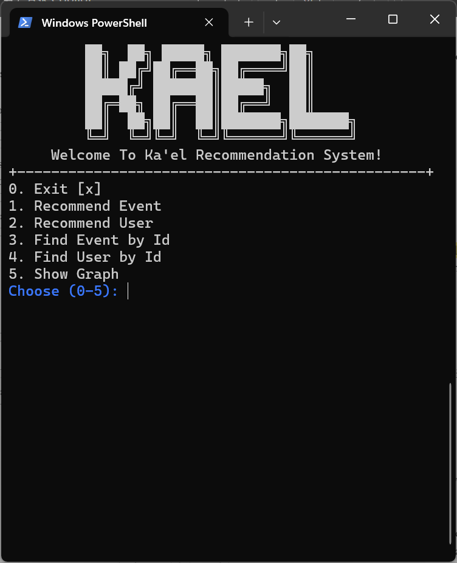
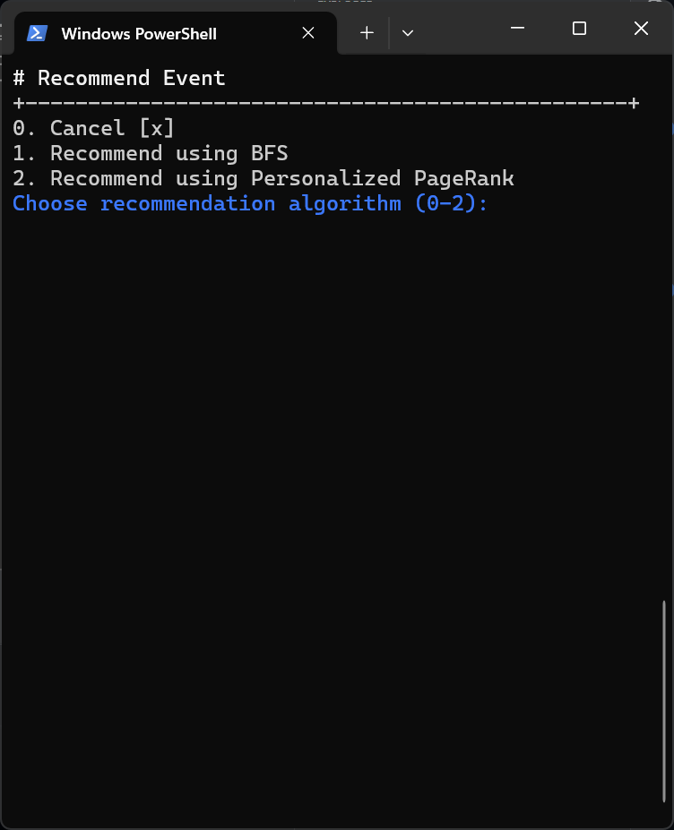
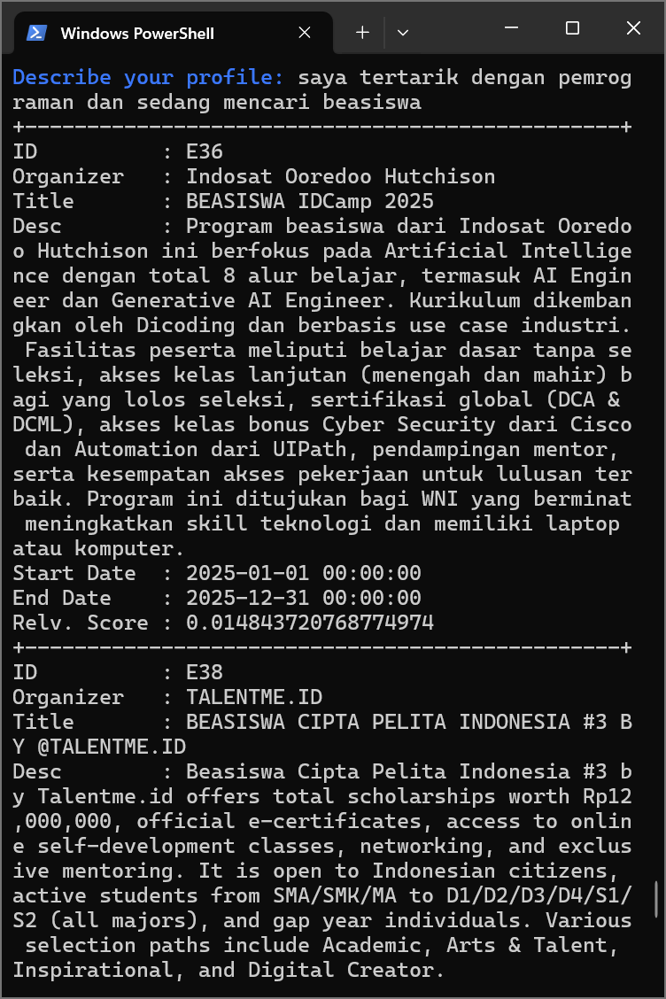
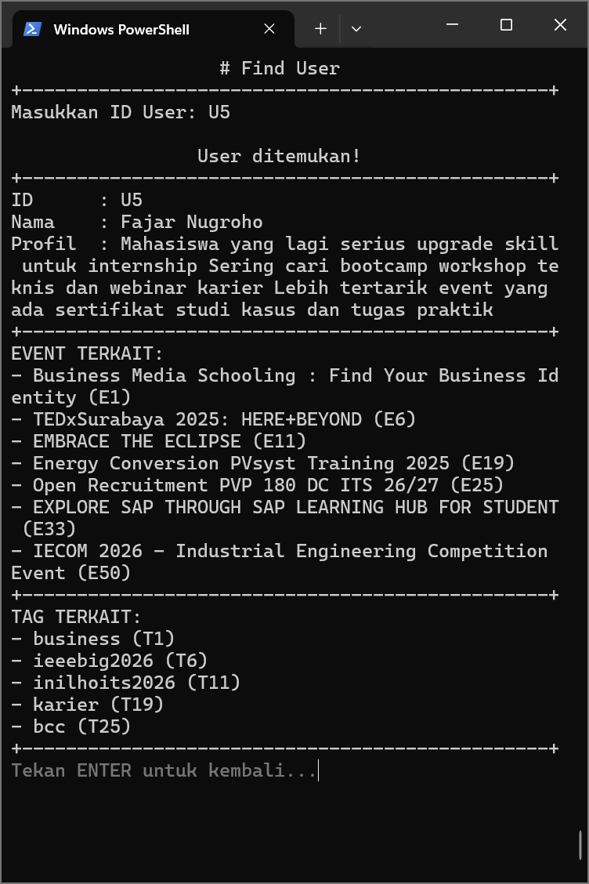
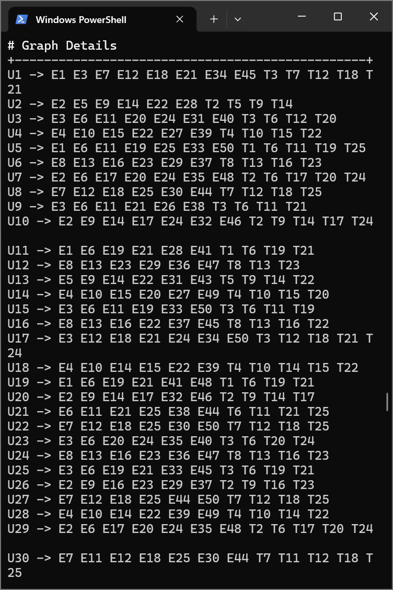

# Sistem Rekomendasi Event Berbasis Graph


**Mata kuliah:** Algoritma dan Struktur Data  
**Dosen Pengampu:** Renny Pradina Kusumawardani  
**Kelas:** D  
**Kelompok:** 2  
**Anggota:**

1. 5026241016 - Christabel Arrowina Putri Tjahyadi
2. 5026241059 - Nayla Rameyza Alya
3. 5026241083 - Gusti Ayu Wedha Putri Surya
4. 5026241107 - Dedy Irama

## Daftar Isi

- [Sistem Rekomendasi Event Berbasis Graph](#sistem-rekomendasi-event-berbasis-graph)
  - [Daftar Isi](#daftar-isi)
  - [1. Latar Belakang](#1-latar-belakang)
  - [2. Deskripsi Masalah](#2-deskripsi-masalah)
  - [3. Solusi](#3-solusi)
  - [4. Fitur](#4-fitur)
  - [5. Representasi Data](#5-representasi-data)
    - [5.1 User](#51-user)
    - [5.2 Event](#52-event)
    - [5.3 Tag](#53-tag)
  - [6. Struktur Data](#6-struktur-data)
    - [6.1 Set](#61-set)
    - [6.2 Map](#62-map)
    - [6.3 List](#63-list)
    - [6.4 Graph](#64-graph)
  - [7. Algoritma](#7-algoritma)
    - [7.1 BFS Recommendation](#71-bfs-recommendation)
    - [7.2 Personalized PageRank (PPR)](#72-personalized-pagerank-ppr)
    - [7.3 Linear Search](#73-linear-search)
    - [7.4 Selection Sort](#74-selection-sort)
  - [8. Alur Program](#8-alur-program)
    - [8.1 Inisialisasi Program](#81-inisialisasi-program)
    - [8.2 Welcome Screen dan Menu Utama](#82-welcome-screen-dan-menu-utama)
    - [8.3 Navigasi Antar Halaman](#83-navigasi-antar-halaman)
    - [8.4 Alur Pencarian User](#84-alur-pencarian-user)
    - [8.5 Alur Pencarian Event](#85-alur-pencarian-event)
    - [8.6 Alur Rekomendasi Event](#86-alur-rekomendasi-event)
    - [8.7 Alur Rekomendasi User](#87-alur-rekomendasi-user)
    - [8.8 Pengakhiran Program](#88-pengakhiran-program)
  - [9. Arsitektur Program](#9-arsitektur-program)
    - [File Utama](#file-utama)
      - [`Main.java`](#mainjava)
      - [`Screen.java`](#screenjava)
      - [`GraphLoader.java`](#graphloaderjava)
    - [Folder `entities/`](#folder-entities)
      - [`User.java`](#userjava)
      - [`Event.java`](#eventjava)
      - [`Tag.java`](#tagjava)
    - [Folder `models/`](#folder-models)
      - [`Graph.java`](#graphjava)
    - [Folder `algorithms/`](#folder-algorithms)
      - [`Personalization.java`](#personalizationjava)
      - [`Scored.java`](#scoredjava)
      - [`Sort.java`](#sortjava)
    - [Folder `utils/`](#folder-utils)
      - [`Terminal.java`](#terminaljava)
      - [`Text.java`](#textjava)
    - [Folder `views/`](#folder-views)
      - [`WellcomeScreen.java`](#wellcomescreenjava)
      - [`RecommendEventScreen.java`](#recommendeventscreenjava)
      - [`RecommendUserScreen.java`](#recommenduserscreenjava)
      - [`FindEventScreen.java`](#findeventscreenjava)
      - [`FindUserScreen.java`](#finduserscreenjava)
      - [`ShowGraphScreen.java`](#showgraphscreenjava)
    - [Folder `resources/`](#folder-resources)
  - [10. Cara Menjalankan Program](#10-cara-menjalankan-program)
  - [11. Tampilan Program](#11-tampilan-program)
    - [11.1 Wellcome Screen](#111-wellcome-screen)
    - [11.2 Recommend Screen](#112-recommend-screen)
    - [11.3 Recommend Result Screen](#113-recommend-result-screen)
    - [11.4 Find User/Event Screen](#114-find-userevent-screen)
    - [11.5 Show Graph Screen](#115-show-graph-screen)
  - [12. Update](#12-update)
  - [13. Daftar Kelompok](#13-daftar-kelompok)

## 1. Latar Belakang

Mahasiswa sering kesulitan menemukan event yang sesuai dengan minat, jurusan, serta tujuan pengembangan diri mereka. Hal ini disebabkan oleh informasi event yang tersebar di berbagai platform dan tidak terkurasi secara terpusat, sehingga banyak peluang penting akhirnya terlewat.

Ka’el awalnya dikembangkan dalam mata kuliah Manajemen Proyek Tangkas (MPT) sebagai sebuah platform yang mampu mengumpulkan berbagai event, mengelompokkannya berdasarkan topik dan kategori, serta menyediakan sistem rekomendasi yang menyesuaikan dengan profil setiap mahasiswa. Platform ini juga dirancang agar mudah diakses melalui Web maupun WhatsApp.

Untuk mendukung fitur rekomendasi tersebut, Ka’el memerlukan struktur data yang dapat memodelkan relasi antara user, tag, dan event, serta algoritma yang mampu menilai tingkat kedekatan dan relevansi event terhadap kebutuhan pengguna.

## 2. Deskripsi Masalah

- Event dan profil pengguna sama-sama memiliki informasi yang kaya, namun belum ada mekanisme otomatis yang mampu mencocokkan keduanya secara akurat. Proses pencarian manual tidak efisien dan sering membuat pengguna melewatkan event yang sebenarnya relevan dengan kebutuhan atau minatnya.
- Meski event dan profil pengguna sama-sama kaya informasi, tidak ada mekanisme otomatis yang mampu mencocokkan keduanya secara akurat. Pencarian manual sering tidak efisien dan dapat melewatkan event yang relevan.

**Bagaimana melakukan pencarian dan rekomendasi event yang relevan berdasarkan deskripsi profil pengguna secara efisien?**

## 3. Solusi

**Rekomendasi Event Menggunakan Graph dengan Modified BFS sebagai Sistem Scoring**  
Mengembangkan sistem rekomendasi berbasis graph dengan memodelkan event, tag, dan pengguna sebagai node. Hubungan antar entitas direpresentasikan sebagai edge. Semua node saling terhubung sehingga relevansi bisa dihitung berdasarkan kedekatan dalam graf.

## 4. Fitur

1. Mendapatkan rekomendasi event yang relevan berdasarkan deskripsi profil pengguna
2. Mendapatkan rekomendasi user yang relevan berdasarkan deskripsi event
3. Mendapatkan detail event berdasarkan ID Event
4. Mendapatkan detail user berdasarkan ID User
5. Menampilkan seluruh struktur graph

## 5. Representasi Data

Secara konsep, program ini adalah sistem rekomendasi **berbasis graf** untuk **User, Event, dan Tag** yang ditampilkan lewat terminal. Terdapat tiga entitas yang didefinisikan di package `org.kael.entities`.

### 5.1 User

- Dipakai untuk merepresentasikan pengguna.
- Field:
  - `id`: ID unik user
  - `name`: nama user
  - `profile`: deskripsi profil
- Dipakai di:
  - `GraphLoader`: memuat user dari CSV user
  - `Graph`: user jadi vertex di graf
- `equals()` dan `hashCode()` berdasarkan `id` sehingga dua objek `User` dengan `id` yang sama akan dianggap sama.
- Kode:

  ```java
  public class User {
    private final String id;
    private final String name;
    private final String profile;
    ...
  }
  ```

### 5.2 Event

- Representasi event yang direkomendasikan.
- Field: info dasar event (judul, deskripsi, tanggal, URL, organizer).
- Dipakai di:

  - `GraphLoader`: data dari `events.csv`
  - `Graph<Object>`: event jadi vertex
  - `RecommendEventScreen` dan `FindEventScreen`

- `equals()` dan `hashCode()` berdasarkan `id`.
- Kode:

  ```java
  public class Event {
    private final String id;
    private final String title;
    private final String slug;
    private final String description;
    private final String organizer;
    private final String startDate;
    private final String endDate;
    private final String url;
    ...
  }
  ```

### 5.3 Tag

- Representasi tag/kategori.
- Dipakai untuk menghubungkan user dan event melalui kategori.
- Dipakai di:

  - `GraphLoader`: data dari `tags.csv`
  - `Graph<Object>`: tag jadi vertex

- Kode:

  ```java
  public class Tag {
    private final String id;
    private final String name;
    private final String slug;
  ...
  }
  ```

## 6. Struktur Data

### 6.1 Set

Struktur data set digunakan untuk menyimpan kumpulan data unik tanpa adanya nilai yang duplikat. Set digunakan dalam sistem rekomendasi untuk menyimpan data event, tag, dan user dengan memastikan tidak ada data yang duplikat.

Digunakan dalam class:

- `Personalization`
- `Graph`
- `RecommendEventScreen`
- `RecommendUserScreen`

### 6.2 Map

Map nantinya akan digunakan dalam sistem rekomendasi untuk menyimpan data berdasarkan key-value untuk mempercepat pencarian dan akses data.

Digunakan dalam class:

- `GraphLoader`
- `Personalization`
- `Graph`
- `RecommendEventScreen`
- `RecommendUserScreen`

### 6.3 List

List digunakan untuk menyimpan rangkaian data terurut dengan ukuran yang dapat disesuaikan dengan ukuran data.

Digunakan dalam class:

- `GraphLoader`
- `Personalization`
- `RecommendEventScreen`
- `RecommendUserScreen`

### 6.4 Graph

Graph digunakan sebagai struktur data utama yang merepresentasikan hubungan antara entitas event-tag-user. Relasi yang dibentuk nantinya akan digunakan untuk mendapatkan hasil rekomendasi menggunakan algoritma BFS yang dimodifikasi.

Digunakan dalam class:

- `Graph`
- `GraphLoader`
- `Personalization`

## 7. Algoritma

### 7.1 BFS Recommendation

Algoritma BFS Recommendation digunakan untuk menjawab kebutuhan "bagaimana mencocokkan deskripsi profil pengguna dalam bentuk teks bebas dengan event-event yang relevan secara otomatis dan efisien".

Profil pengguna terlebih dahulu dikonversi menjadi beberapa simpul awal (_starting nodes_) di dalam graf, misalnya node tag atau event yang mengandung kata kunci dari profil tersebut. Dari kumpulan _starting nodes_ ini, sistem menjalankan penelusuran Breadth-First Search (BFS) hingga kedalaman tertentu dan memberikan skor pada setiap node yang dilewati.

Secara garis besar, alur kerja BFS Recommendation adalah sebagai berikut:

- Profil pengguna dipecah menjadi kata-kata, lalu setiap kata dicocokkan dengan teks pada node graf (tag, event, dan entitas lain) untuk mendapatkan _starting nodes_.
- Untuk setiap _starting node_, algoritma BFS dijalankan level demi level hingga batas `maxDepth`. Setiap node yang berhasil dikunjungi dalam batas kedalaman ini diberi tambahan skor sebesar `1` pada sebuah map skor.
- Skor dari semua _starting nodes_ dijumlahkan pada map yang sama, sehingga node yang sering tercapai dari berbagai _starting nodes_ akan memiliki skor total yang lebih tinggi.
- Setelah penelusuran selesai, skor dinormalisasi sehingga totalnya menjadi `1` dan dapat dipahami sebagai distribusi “peluang relevansi” terhadap profil pengguna.
- Map skor kemudian diubah menjadi daftar, diurutkan dari skor tertinggi, lalu hanya node yang mewakili event yang diambil sebagai Top-N rekomendasi.

Dengan pendekatan ini, BFS Recommendation tidak sekadar mencari event berdasarkan kecocokan kata kunci, tetapi juga mempertimbangkan kedekatan struktural di dalam graf user–tag–event. Hal ini membuat proses pencarian menjadi otomatis, terarah, dan lebih efisien dibandingkan pencarian manual.

Pada kode program, algoritma BFS Recommendation diimplementasikan pada kelas `Personalization` berupa method `bfsRecommendation()`.

### 7.2 Personalized PageRank (PPR)

Personalized PageRank (PPR) disiapkan sebagai pengembangan dari BFS Recommendation untuk memberikan rekomendasi yang lebih kaya dan sensitif terhadap struktur global graf, namun tetap terpersonalisasi terhadap profil pengguna.

Berbeda dengan BFS yang fokus pada kedekatan lokal dalam radius kedalaman tertentu, PPR memodelkan proses _random walk_ di sepanjang graf dengan kemungkinan _restart_ ke node-node yang mewakili preferensi pengguna.

Intuisi kerjanya adalah sebagai berikut. Bayangkan seorang “walker” yang berjalan di graf. Pada setiap langkah, dengan probabilitas tertentu walker mengikuti edge ke tetangga secara acak, dan dengan probabilitas lain ia “kembali” ke sekumpulan node yang menggambarkan profil user (vektor personalisasi).

Node yang sering dikunjungi dalam jangka panjang akan memperoleh skor PPR tinggi, dan skor ini diinterpretasikan sebagai ukuran relevansi node tersebut terhadap profil pengguna.

Secara implementasi, sistem menyusun vektor personalisasi dari node-node yang relevan dengan profil user, menginisialisasi vektor peringkat awal, lalu melakukan iterasi pembaruan nilai peringkat sampai konvergen: sebagian skor dialokasikan untuk _restart_ ke profil user, dan sisanya didistribusikan merata ke tetangga melalui edge yang ada.

Nilai akhir Personalized PageRank kemudian digunakan sebagai skor rekomendasi, dengan cara mengurutkan node berdasarkan skor dan memilih node event dengan nilai tertinggi.

Melalui pendekatan ini, PPR mampu menemukan event yang relevan tidak hanya karena dekat secara langsung dengan profil user, tetapi juga karena berada pada posisi penting dalam struktur graf secara keseluruhan.

Pada kode program, algoritma PPR diimplementasikan pada kelas `Personalization` berupa method `personalizedPageRank()`.

### 7.3 Linear Search

Algoritma searching yang digunakan untuk mencari node dalam kumpulan node pada graph. Hasil pencarian nantinya akan digunakan sebagai titik mulai untuk algoritma skoring.

Pada kode program, algoritma Linear Search diimplementasikan pada kelas `Graph` berupa method `search()`.

### 7.4 Selection Sort

Algoritma sorting yang akan digunakan untuk mengurutkan node pada graph berdasarkan nilai skor. Hasil sorting ini akan digunakan untuk menentukan item yang akan direkomendasikan ke pengguna.

Pada kode program, algoritma Selection Sort diimplementasikan pada kelas `Sort` berupa method `selectionSort()`.

## 8. Alur Program

### 8.1 Inisialisasi Program

1. Program dijalankan melalui kelas utama (main).
2. Sistem melakukan inisialisasi terminal sebagai pengatur tampilan aplikasi.
3. Data user, event, dan tag dimuat dari sumber data melalui graph loader.
4. Seluruh data disimpan ke dalam struktur graph beserta relasi antar data.
5. Setelah proses inisialisasi selesai, sistem menampilkan halaman awal (welcome screen).

### 8.2 Welcome Screen dan Menu Utama

1. Welcome screen menampilkan judul aplikasi dan daftar fitur yang tersedia.
2. Fitur yang disediakan meliputi pencarian user, pencarian event, rekomendasi event, rekomendasi user, dan keluar dari aplikasi.
3. Pengguna memilih fitur dengan memasukkan input sesuai menu yang ditampilkan.
4. Sistem melakukan validasi terhadap input pengguna.
5. Jika input valid, sistem mengarahkan pengguna ke halaman fitur yang dipilih

### 8.3 Navigasi Antar Halaman

1. Setiap fitur direpresentasikan sebagai sebuah screen.
2. Screen bertanggung jawab untuk menampilkan antarmuka, menerima input, dan menjalankan logika fitur.
3. Perpindahan antar screen dikontrol oleh terminal.
4. Setelah suatu fitur selesai dijalankan, pengguna dapat kembali ke menu utama atau berpindah ke fitur lain.

### 8.4 Alur Pencarian User

1. Sistem meminta pengguna memasukkan identitas user.
2. Sistem melakukan pencarian data user pada struktur graph.
3. Jika user ditemukan, sistem menampilkan informasi detail user.
4. Sistem menampilkan relasi user dengan event dan tag terkait.
5. Jika user tidak ditemukan, sistem menampilkan pesan kesalahan dan kembali ke menu sebelumnya.

### 8.5 Alur Pencarian Event

1. Sistem meminta pengguna memasukkan identitas event.
2. Sistem melakukan pencarian data event pada struktur graph.
3. Jika event ditemukan, sistem menampilkan detail event.
4. Sistem menampilkan relasi event dengan user dan tag terkait.
5. Jika event tidak ditemukan, sistem menampilkan pesan bahwa data tidak tersedia.

### 8.6 Alur Rekomendasi Event

1. Sistem meminta pengguna memilih algoritma rekomendasi yang akan digunakan.
2. Pengguna memasukkan deskripsi profil atau kata kunci minat.
3. Sistem melakukan tokenisasi terhadap input pengguna.
4. Sistem mencari node yang relevan di dalam graph.
5. Sistem menghitung skor relevansi menggunakan algoritma yang dipilih.
6. Skor hasil perhitungan dinormalisasi agar dapat dibandingkan.
7. Data rekomendasi diurutkan berdasarkan skor relevansi.
8. Sistem menyaring hasil sehingga hanya data bertipe event yang ditampilkan.
9. Sistem menampilkan daftar event dengan skor relevansi tertinggi.

### 8.7 Alur Rekomendasi User

1. Sistem meminta pengguna memilih algoritma rekomendasi.
2. Pengguna memasukkan deskripsi profil atau kata kunci.
3. Sistem membentuk seed berdasarkan hasil pencarian di graph.
4. Sistem menghitung skor relevansi untuk setiap user.
5. Hasil perhitungan dinormalisasi dan diurutkan.
6. Sistem menampilkan daftar user dengan tingkat relevansi tertinggi.

### 8.8 Pengakhiran Program

1. Setelah suatu fitur selesai dijalankan, pengguna dapat kembali ke menu utama.
2. Jika pengguna memilih opsi keluar, sistem menghentikan proses aplikasi.
3. Program berakhir dengan menutup seluruh sumber daya yang digunakan.

## 9. Arsitektur Program

Struktur program dibangun untuk memisahkan logika algoritma, model data, pemrosesan graf, antarmuka terminal, dan layar tampilan. Berikut penjelasan folder dan file utama pada proyek:

```txt
kael-recommendation-system/
├── pom.xml
└── src
    ├── main
    │   ├── java
    │   │   └── org
    │   │       └── kael
    │   │           ├── Main.java
    │   │           ├── GraphLoader.java
    │   │           ├── Screen.java
    │   │           ├── algorithms
    │   │           │   ├── Personalization.java
    │   │           │   ├── Scored.java
    │   │           │   └── Sort.java
    │   │           ├── entities
    │   │           │   ├── User.java
    │   │           │   ├── Event.java
    │   │           │   └── Tag.java
    │   │           ├── models
    │   │           │   └── Graph.java
    │   │           ├── utils
    │   │           │   ├── Terminal.java
    │   │           │   └── Text.java
    │   │           └── views
    │   │               ├── WellcomeScreen.java
    │   │               ├── RecommendEventScreen.java
    │   │               ├── RecommendUserScreen.java
    │   │               ├── FindEventScreen.java
    │   │               ├── FindUserScreen.java
    │   │               └── ShowGraphScreen.java
    │   └── resources
    │       ├── users.csv
    │       ├── events.csv
    │       ├── tags.csv
    │       ├── user_event.csv
    │       ├── user_tag.csv
    │       └── event_tag.csv
    └── test
        └── java
```

### File Utama

#### `Main.java`

Entry point program. Menginisialisasi terminal, memuat graph dari dataset CSV melalui `GraphLoader`, lalu menjalankan layar awal (wellcome screen). Program CLI berjalan sepenuhnya melalui navigasi antarlayar.

#### `Screen.java`

Interface yang digunakan seluruh layar tampilan (UI).

#### `GraphLoader.java`

Modul yang bertanggung jawab membaca file CSV dari folder `resources`, membangun objek `User`, `Event`, dan `Tag`, lalu memetakan relasi antar-entitas ke dalam graph menggunakan `Graph<T>`.

### Folder `entities/`

Berisi representasi objek domain yang menjadi node dalam graph.

#### `User.java`

Mewakili data pengguna, berisi id, nama, dan deskripsi profil.

#### `Event.java`

Mewakili data event, termasuk id, judul, deskripsi, penyelenggara, tanggal, URL, dll.

#### `Tag.java`

Mewakili tag atau kategori, digunakan untuk memetakan kategori user dan event.

### Folder `models/`

#### `Graph.java`

Struktur graf generik yang mendukung penambahan vertex, edge, pencarian neighbor, dan utilitas lain. Graph digunakan sebagai representasi relasi antar user, event, dan tag. Mendukung graph berarah maupun tidak.

### Folder `algorithms/`

Berisi algoritma untuk proses penilaian dan pengurutan rekomendasi.

#### `Personalization.java`

Mengimplementasikan:

- Algoritma **BFS-based recommendation**
- Algoritma **Personalized PageRank (PPR)** untuk menentukan skor relevansi event berdasarkan deskripsi profil pengguna.

#### `Scored.java`

Wrapper generik yang menyimpan objek beserta skor relevansinya.

#### `Sort.java`

Implementasi selection sort, digunakan untuk mengurutkan hasil rekomendasi berdasarkan skor.

### Folder `utils/`

#### `Terminal.java`

Abstraksi untuk input dan output CLI. Mengatur:

- pembacaan input user,
- pembersihan layar,
- navigasi antar screen.

#### `Text.java`

Utility untuk format teks (warna, bold, highlight) agar tampilan CLI lebih mudah dibaca.

### Folder `views/`

Berisi seluruh layar antarmuka pengguna.

#### `WellcomeScreen.java`

Layar awal yang menampilkan menu utama program.

#### `RecommendEventScreen.java`

Mengelola proses rekomendasi event:

- menerima input profil,
- menjalankan BFS atau PPR,
- menampilkan hasil rekomendasi.

#### `RecommendUserScreen.java`

Mirip dengan event, tetapi memberi rekomendasi pengguna lain yang relevan.

#### `FindEventScreen.java`

Fitur pencarian event berdasarkan id event.

#### `FindUserScreen.java`

Fitur pencarian user berdasarkan id user.

#### `ShowGraphScreen.java`

Menampilkan graph berupa node dan daftar tetangganya.

### Folder `resources/`

Dataset berupa CSV:

- `users.csv`
- `events.csv`
- `tags.csv`
- `user_tag.csv`
- `event_tag.csv`
- `user_event.csv`

Seluruh file digunakan `GraphLoader` untuk membentuk graph **User–Tag–Event**.

## 10. Cara Menjalankan Program

> Jika menggunakan IntelliJ, klon repository melalui fitur _New Project from Version Control_ pada IntelliJ. Kemudian untuk menjalankan program, klik tombol `Run` pada IntelliJ.

1. Persiapan lingkungan

   - Pastikan sudah terpasang:

     - Java Development Kit (JDK) versi 23 (atau minimal versi yang kompatibel).
     - Apache Maven.

   - Pastikan perintah `java` dan `mvn` sudah dikenali di terminal (cek dengan `java -version` dan `mvn -version`).

2. Kloning dan buka project

   - Klon project ini:

     ```bash
     git clone https://github.com/dedyirama-id/kael-recommendation-system.git
     ```

   - Masuk ke folder project, misalnya:

     ```bash
     cd kael-recommendation-system
     ```

3. Kompilasi program

   - Jalankan perintah:

     ```bash
     mvn clean compile
     ```

   - Perintah ini akan mengompilasi seluruh kode sumber ke dalam folder `target`.

4. Menjalankan program

   - Setelah kompilasi berhasil, jalankan aplikasi dengan:

     ```bash
     mvn exec:java
     ```

   - Maven akan mengeksekusi kelas utama `org.kael.Main` sesuai konfigurasi di `pom.xml`.

5. Interaksi di terminal

   - Program akan menampilkan menu awal di terminal.
   - Gunakan input angka/teks sesuai instruksi di layar untuk:

     - melihat rekomendasi event,
     - melihat rekomendasi user,
     - mencari event/user,
     - atau menampilkan ringkasan graf.

   - Ikuti pesan seperti “Press ENTER to continue...” untuk berpindah layar.

## 11. Tampilan Program

### 11.1 Wellcome Screen

Halaman welcome screen yang ditampilkan pertama kali ketika pengguna menjalankan program.


### 11.2 Recommend Screen

Halaman pilihan algoritma ketika pengguna memilih rekomendasi user/event pada welcome screen.


### 11.3 Recommend Result Screen

Halaman hasil rekomendasi setelah pengguna mengisi detail profile/event untuk rekomendasi. Gambar di bawah merupakan contoh hasil rekomendasi event.


### 11.4 Find User/Event Screen

Halaman hasil pencarian user/event berdasarkan ID. Gambar dibawah merupakan contoh hasil pencarian user.


### 11.5 Show Graph Screen

Halaman untuk menampilkan daftar relasi graph.


## 12. Update

Update yang dilakukan, mencakup:

1. Tanggal update : 12 Desember 2025
2. Deskripsi update : Menambahkan start date dan end date pada rekomendasi event dan email pada rekomendasi user
3. File tempat update tersebut dilakukan : `RecommendEventScreen` dan `RecommendUserScreen`

## 13. Daftar Kelompok

D-1 : Word Rank Guesser Game  
Link : <https://github.com/NashiwaInsan/asdfinalproject>

D-2 : Sistem Rekomendasi Event Berbasis Graph  
Link : <https://github.com/dedyirama-id/kael-recommendation-system>

D-3 : Smart Traffic Light Simulator  
Link : <https://github.com/Sudukk/FP_ASD_Traffic_Light_Simulation_FINAL>

D-4 : HotelSeek - Rekomendasi Pemilihan Hotel  
Link : <https://github.com/dreadf/hotelseek>

D-5 :  
Link :

D-6 : To-Do List  
Link : <https://github.com/anggraitapr/ASDFPTODOLIST>

D-7 : Sistem Antrian IGD  
Link : <https://github.com/WilliamHanantha/FP-ASD>

D-8 : Sistem Rekomendasi Jadwal Latihan dan Nutrisi Gym  
Link :<https://github.com/tyr3x74/GymPlan>

D-9 : Sistem Rekomendasi Teman Berdasarkan Mutual Friends  
Link :<https://github.com/mariaelvina/FinalProjectD9>

D-10 : Monster Chase  
Link : <https://github.com/Aida41104/FPASD>

D-11 : Warehouse Management System  
Link : <https://github.com/FasaBil/ASD-D11-Inventory-Management>

D-12 : Smart Traveling Planner  
Link : <https://github.com/Dziky05/FP-ASD-KEL-13>

D-13 : Sistem Manajemen Inventaris Gudang dan Optimasi Rute Pengiriman  
Link : <https://github.com/FashaAsshofa/Final-Project-ASD-D-Kelompok-13>

D-14 : Rekomendasi Film berbasis Graph  
Link : <https://github.com/neutralcheeze/final-project-asd.git>
